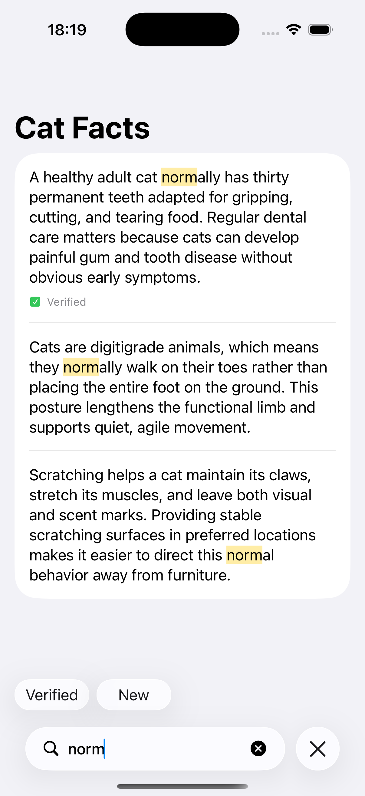
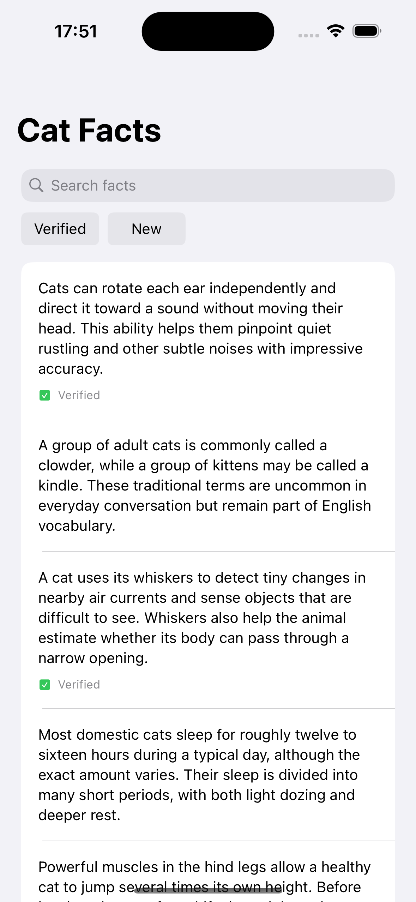
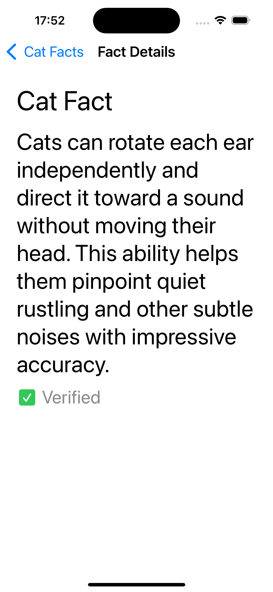

# Cat Facts

A UIKit take-home application for iOS 17 and later for browsing and searching cat facts, with an emphasis on decisions that remain useful as the product grows.

## Design decisions

- **Architecture:** MVVM, coordinator-based navigation, and dependency injection keep features, navigation, and networking independent. These boundaries make future extensions easier and allow components to be extracted into separate modules when needed.
- **API DTO and domain model:** `CatFactDTO` represents the backend response; `CatFact` represents what the application needs. They can evolve independently, with mapping confined to the service boundary.
- **Dependency management:** CocoaPods was replaced with Swift Package Manager for a more modern, native Xcode workflow and simpler project setup.
- **Dependencies with a purpose:** Alamofire is isolated behind a transport protocol; Swift Algorithms makes deduplication readable and offers reusable algorithms as the application grows.
- **Programmatic layout:** application screens are built in code to make merge requests easier to review and reduce storyboard conflicts. SnapKit improves constraint readability.
- **Consistent formatting:** [SwiftFormat](.swiftformat) reduces formatting-only diffs and cognitive load during merge request reviews.

## User experience

- **iOS 18 and iOS 26:** familiar UIKit presentation on iOS 18 and Liquid Glass on iOS 26 preserve familiar interaction patterns before and after the redesign, while sharing list and business logic.
- **Search:** local filtering avoids a network request for each keystroke. Search and filter state survive panel auto-hide; public UIKit APIs avoid dependence on internal view hierarchies.
- **Accessibility:** Dynamic Type, VoiceOver descriptions, semantic colors, and text alongside status icons make content usable beyond the default appearance. Custom panel and keyboard animations respect Reduce Motion.
- **Reusable indicators:** a shared status component keeps appearance and accessibility behavior consistent between the list and details.

## Reliability

- **Actionable errors:** offline, timeout, and server failures have distinct localized messages and a retry action; other failures use a generic fallback. Each message category has unit-test assertions.
- **Cancellation:** cancelled work restores the previous state instead of displaying a network error. Loading tasks have an explicit owner, and overlapping loads are prevented.
- **Data handling:** explicit decoding rules and stable IDs make malformed responses and duplicates predictable. API assumptions are recorded in [docs/API.md](docs/API.md).
- **Date decoding:** one decoder and one formatter are created per response and reused for the entire array, avoiding formatter creation for each record. Explicit locale and calendar settings keep decoding independent of device preferences.

## Localization

Interface and VoiceOver strings use `String(localized:)` and the system-selected app language. Translations cover 10 languages: English, Spanish, French, German, Brazilian Portuguese, Russian, Arabic, Hindi, Simplified Chinese, and Japanese. Fact text retains the language supplied by the backend.

## Previews

Xcode Previews cover the list and details, both UI variants, loading, empty and error states, duplicate IDs, dark mode, and large text. Local fixtures allow UI review without a live server. Preview helpers are excluded from Release builds.

  
  
  
  

  
  
  
  

  
  
  
  

## Tests

Unit tests exercise decoding, date boundaries, transport errors, state transitions, retry, search and filter combinations, error-message mapping, and completeness of localized resources. Injected services and a custom `URLProtocol` keep these tests independent of the live API.

UI tests cover search with filters, navigation to details and back, clearing empty search results, recovery after an offline error, and search-panel auto-hide. A separate `CatFactsUITestHost` target shares the app's screens and navigation and reuses `FactsServiceStub` for deterministic data, keeping test setup out of the app's startup code. Run `CatFactsUITests` using the `CatFacts` scheme on iPhone simulators with iOS 18 and iOS 26 to check both presentations.

## Current gaps

The freshness rule currently also marks future-dated facts as new.
